# Movie Dataset Analysis Project

## Project Overview

This project involves a detailed analysis of a movie dataset using Python and Pandas. The aim is to clean, preprocess, and visualize the data to uncover patterns, trends, and key insights within the cinematic data landscape. Through this analysis, various aspects of movie performance, trends, and industry impacts are explored, demonstrating expertise in data wrangling, exploratory data analysis (EDA), and data visualization.

## Objectives

- **Data Cleaning and Preprocessing:**  
  Streamline the dataset by removing unnecessary columns, handling missing values, and creating new columns for enhanced analysis.

- **Exploratory Data Analysis (EDA):**  
  Visualize key metrics such as movie popularity, average ratings, and return on investment (ROI) over time to identify significant trends.

- **Data Visualization:**  
  Employ various visualization techniques to present data insights effectively, including histograms, scatter plots, and treemaps.

## Key Steps and Insights

- **Removing Unnecessary Columns:**  
  Eliminated columns that did not contribute to the analysis, making the dataset more manageable and focused.

- **Handling Missing Data:**  
  Addressed NULL values by removing rows with critical missing data and replacing NULL values with zeros where appropriate.

- **Creating Additional Columns:**  
  Added new columns to the dataset to facilitate more in-depth analysis and insights.

- **Visualizing Data Distribution:**  
  Used histograms to explore the distribution of data in selected columns, revealing key trends and patterns.

  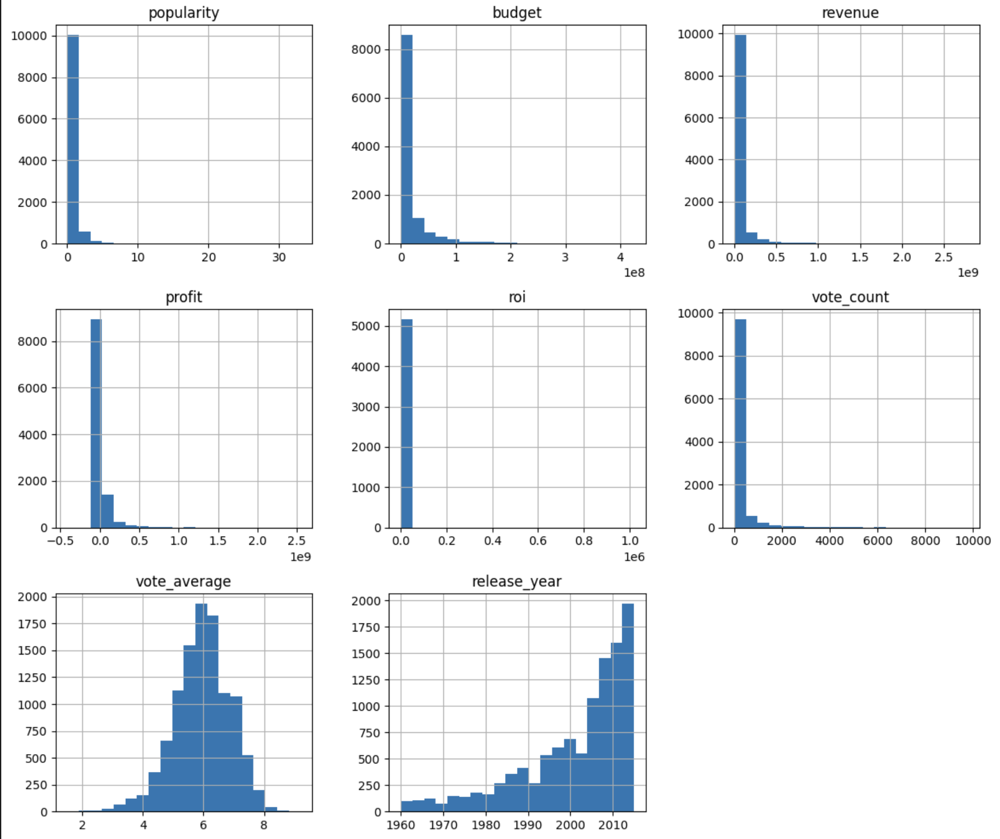

- **Analyzing ROI Trends:**  
  Examined the average return on investment (ROI) for movies across different release years to understand investment performance over time.

  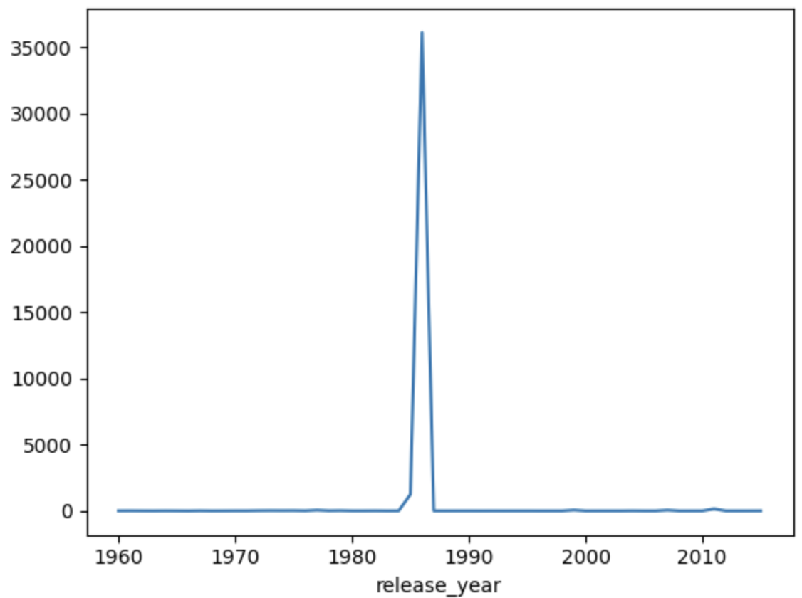

- **Tracking Popularity Trends:**  
  Visualized changes in movie popularity over the years to identify trends and shifts in audience interests.

  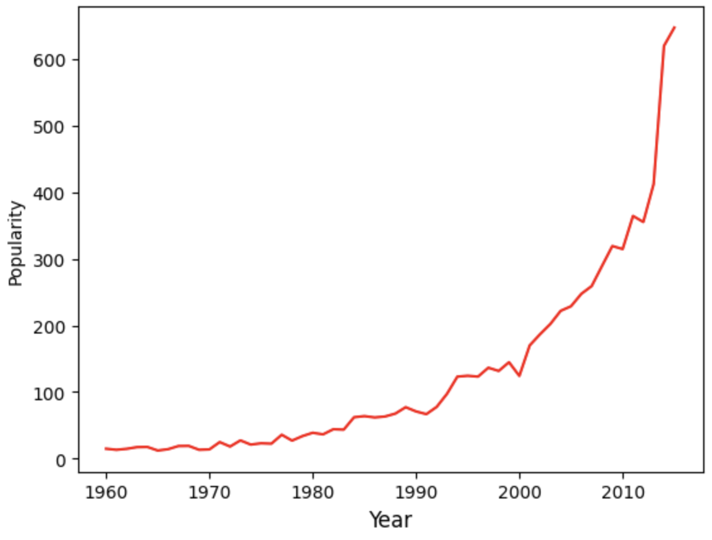

- **Evaluating Average Ratings:**  
  Plotted the evolution of average movie ratings over time to assess changes in viewer opinions.

  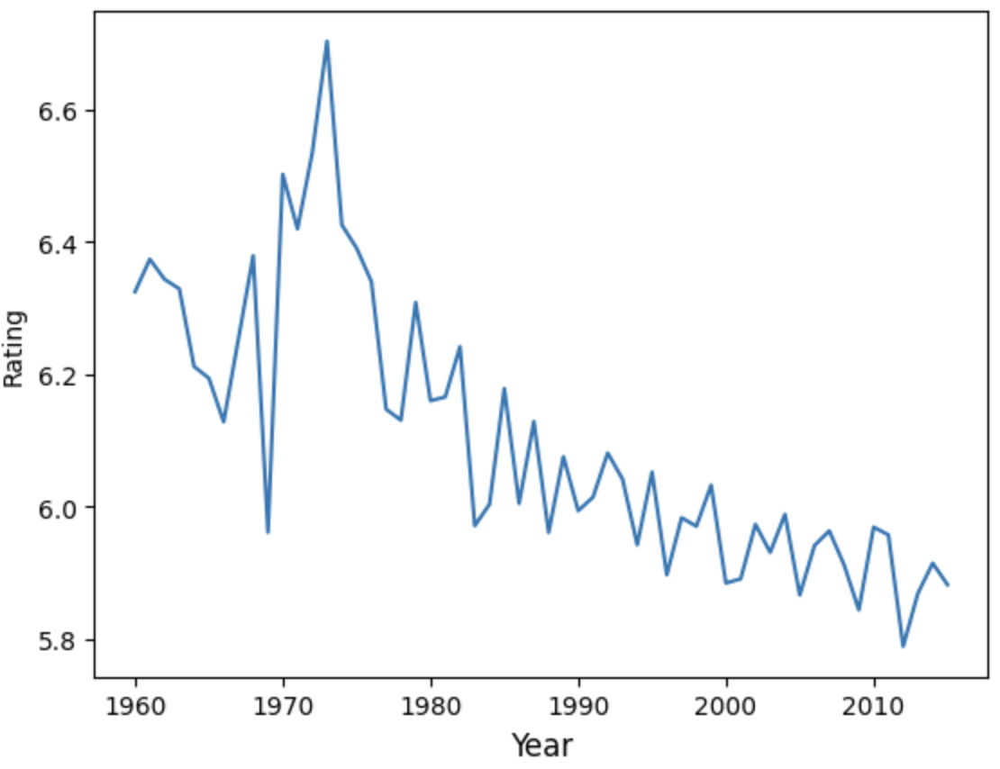

- **Exploring Popularity vs. Rating:**  
  Created scatter plots to analyze the relationship between movie popularity and rating, uncovering dependencies.

  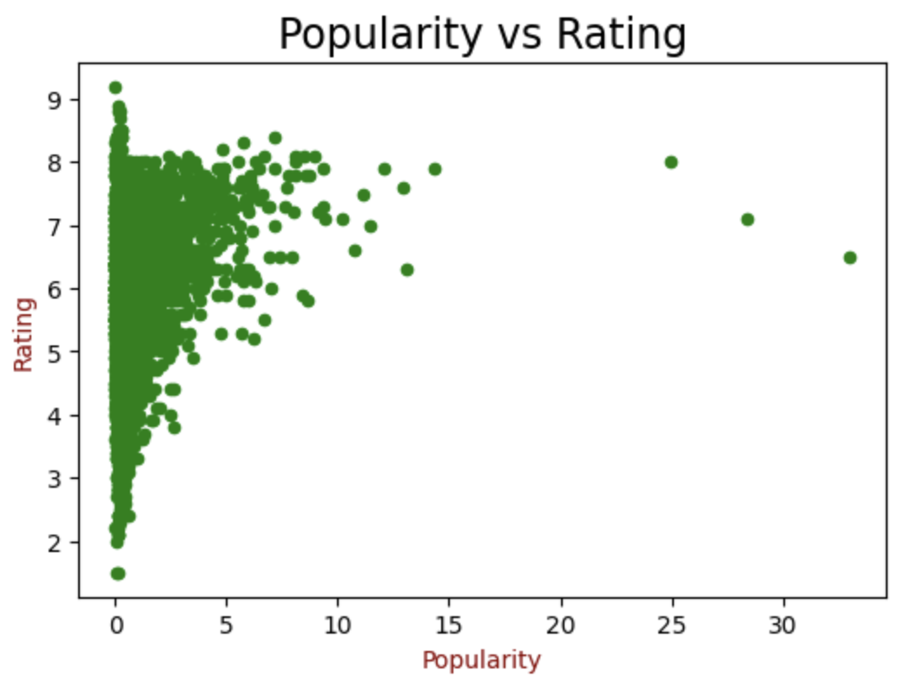

- **Genre Analysis:**  
  Split genre values and explored their impact on movie popularity, revealing insights into genre preferences.

  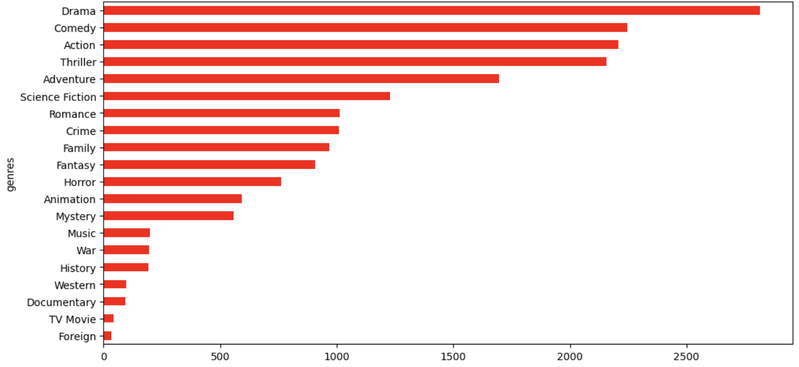

- **Monthly Popularity Trends:**  
  Investigated movie popularity trends across different months to understand seasonal patterns.

  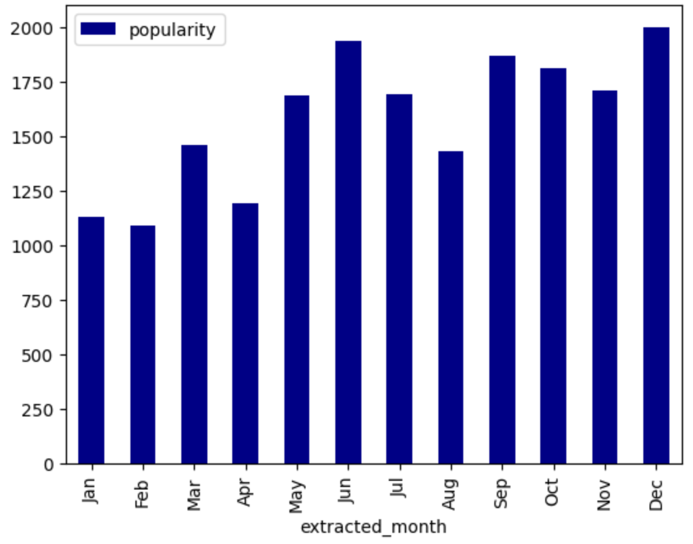

- **Top-Grossing Movies:**  
  Identified the most popular movies by revenue, highlighting financial success in the industry.

  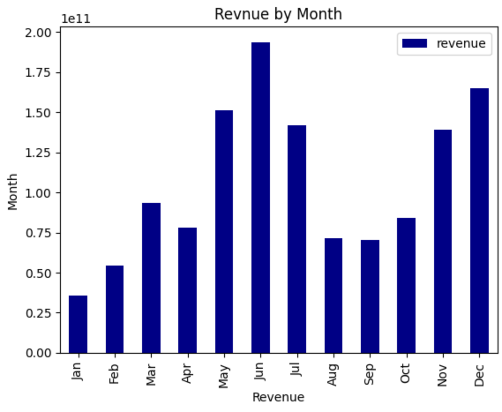

- **Most Popular Titles by Profit:**  
  Listed top movies by profit to reveal which films are both successful and financially rewarding.

  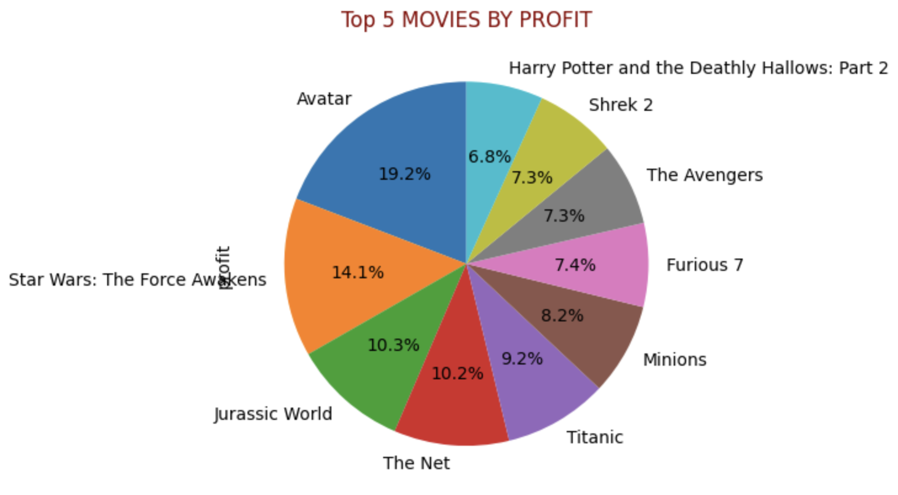

- **Popular Production Companies:**  
  Developed a treemap to visualize the prevalence of various keywords in movies, providing insights into common themes and trends.

  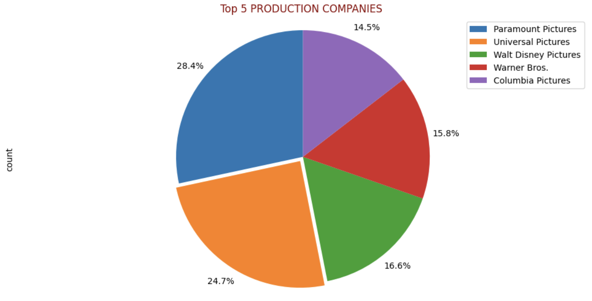

- **Keywords Analysis with Treemap:**  
  Visualized production companies with the highest impact in terms of movie popularity.

  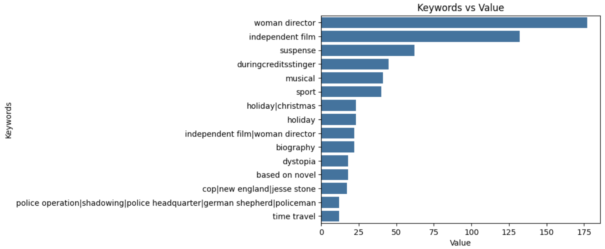

## Technologies Used

- **Python:** For data analysis and manipulation.
- **Pandas:** For data cleaning, preprocessing, and analysis.
- **Matplotlib & Seaborn:** For data visualization.
- **Jupyter Notebook:** For documenting and running analysis 

